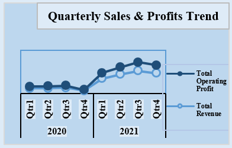
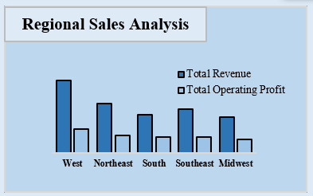
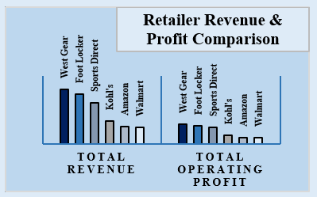
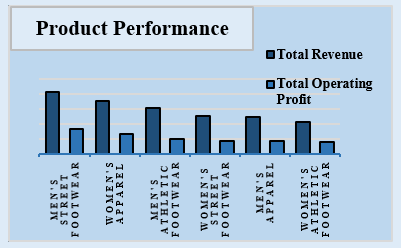
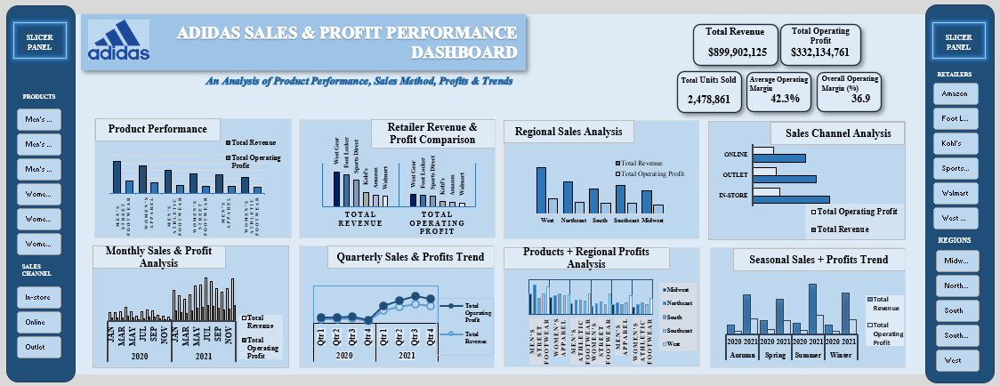

# Adidas Sales Analysis

## Project Overview

This project analyses Adidas sales data to identify trends in sales performance, product categories, retail channels, regions, and seasonal demand.

The analysis was conducted using Microsoft Excel to generate actionable business insights and recommendations that could support sales growth, inventory planning, channel optimisation, and regional strategy.

## Business Questions

- Which product categories generate the highest revenue and profit?
- Which sales channels perform best?
- Which regions contribute the most to sales?
- Which retail partners perform best?
- Are there seasonal sales patterns?
- Which product categories are underperforming?
- How can Adidas improve sales and profitability?

## Tools Used

- Microsoft Excel
- Pivot Tables
- Pivot Charts
- Data Cleaning
- Data Analysis
- Business Intelligence
- Data Visualisation

## Key Findings

### Product Performance

Men's Street Footwear was the strongest-performing product category in terms of sales revenue and operating profit.

### Sales Channels

In-store sales generated the highest revenue, followed by outlet, while online sales contributed the least to profit.

### Regional Performance

The West region generated the highest overall sales, while specific product categories performed particularly well in other regions.

### Seasonal Trends

Sales consistently increased during Q3 in both 2020 and 2021, suggesting a recurring seasonal demand pattern.

### Retail Partners

West Gear was the strongest-performing retail partner, while Walmart recorded the lowest overall sales revenue and operating profit.

## Visualisations

### Quarterly Sales & Profit Trend

### Regional Sales Analysis

### Retailer Revenue & Profit Comparison

### Product Performance

### Adidas Sales Dashboard

## Recommendations

Based on the analysis:

- Prioritise high-performing products such as Men's Street Footwear.
- Improve inventory allocation in high-performing regions.
- Strengthen online sales and digital marketing.
- Use Q3 demand patterns to improve inventory planning.
- Develop region-specific product and marketing strategies.
- Optimise product allocation across retail partners.

## Project Files

- `Adidas Sales Dataset.xlsx` – Excel dataset containing the sales data and analysis.
- `Adidas_Sales_Dashboard.png` – Screenshot of the completed Excel dashboard.
- `product-performance.png` – Product category revenue and operating profit visualisation.
- `quarterly-sales-profits.png` – Quarterly sales and profit visualisation.
- `regional-sales-analysis.png` – Regional revenue and operating profit visualisation.
- `retailer-revenue-profit-comparison.png` – Retailer revenue and operating profit comparison.
- `Adidas Recommendation.docx` – Detailed business recommendations based on the analysis.

## Conclusion

The analysis identified clear differences in product, regional, channel, seasonal, and retail-partner performance. These insights can support more targeted inventory allocation, marketing, product development, and sales strategies.
